# Architecture & Component Interaction

## System Architecture Diagram

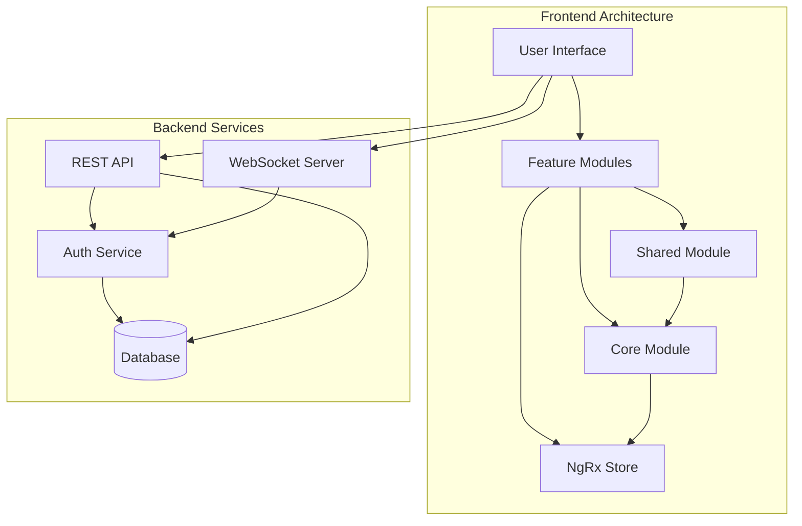

## Module Dependencies

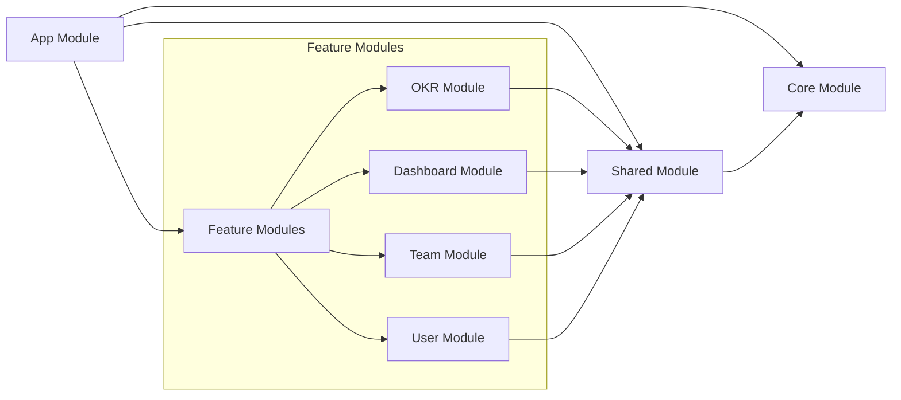

## Data Flow Architecture

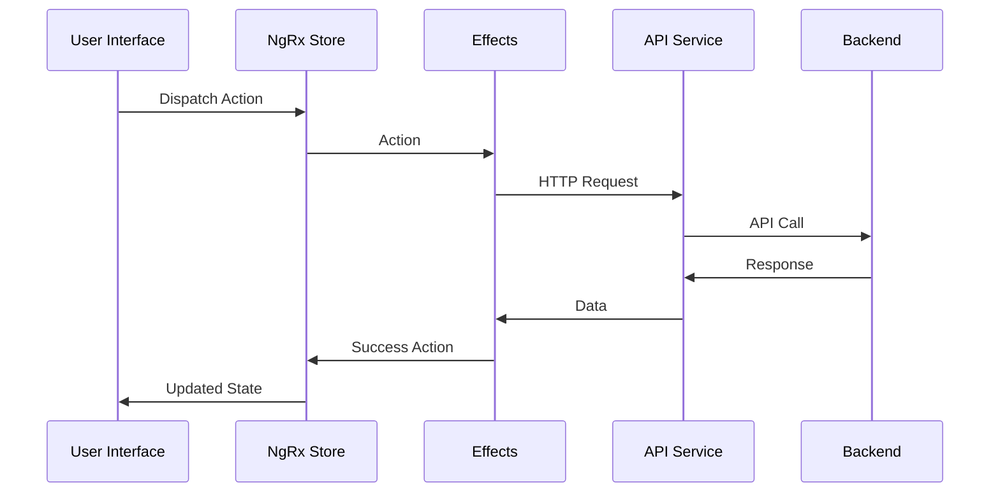

## Component Communication

### Smart vs. Presentational Components
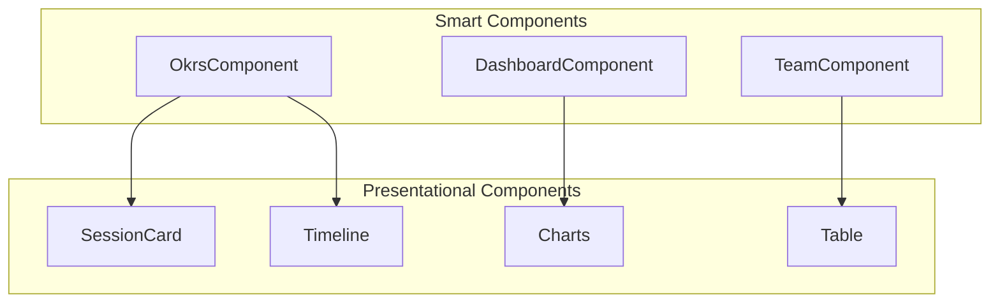

## State Management Flow

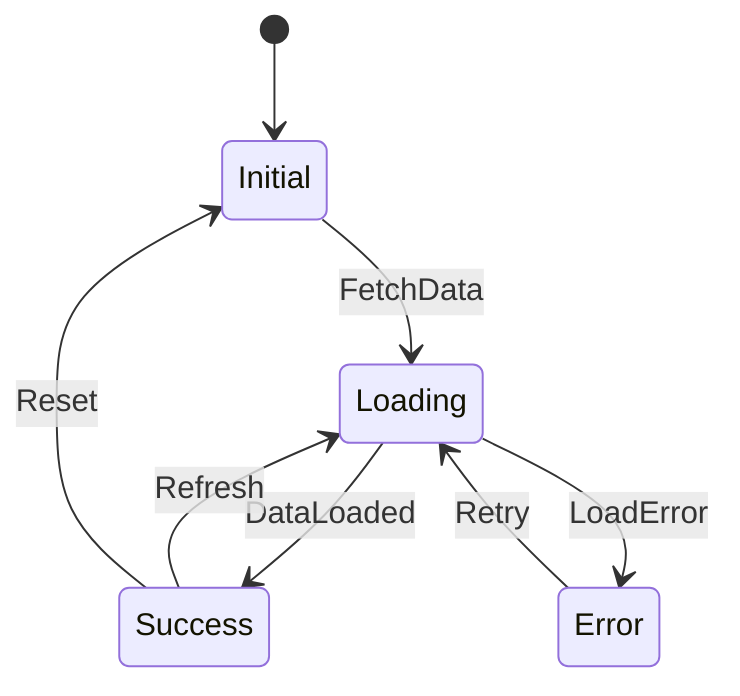

## Authentication Flow

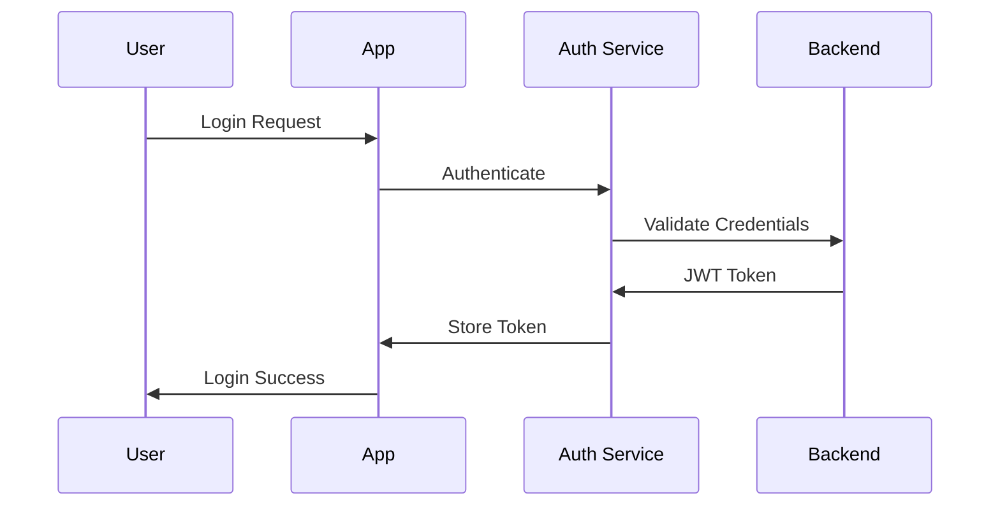

## Real-time Updates Architecture

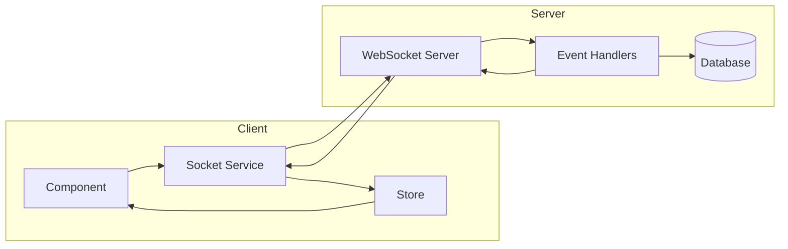

## Module Structure Details

### Core Module
- Singleton services
- Guards
- Interceptors
- Base components

### Shared Module
- Reusable components
- Directives
- Pipes
- Common services

### Feature Modules
Each feature module follows:
- Components
- Services
- State management
- Routing
- Guards

## Component Lifecycle Integration

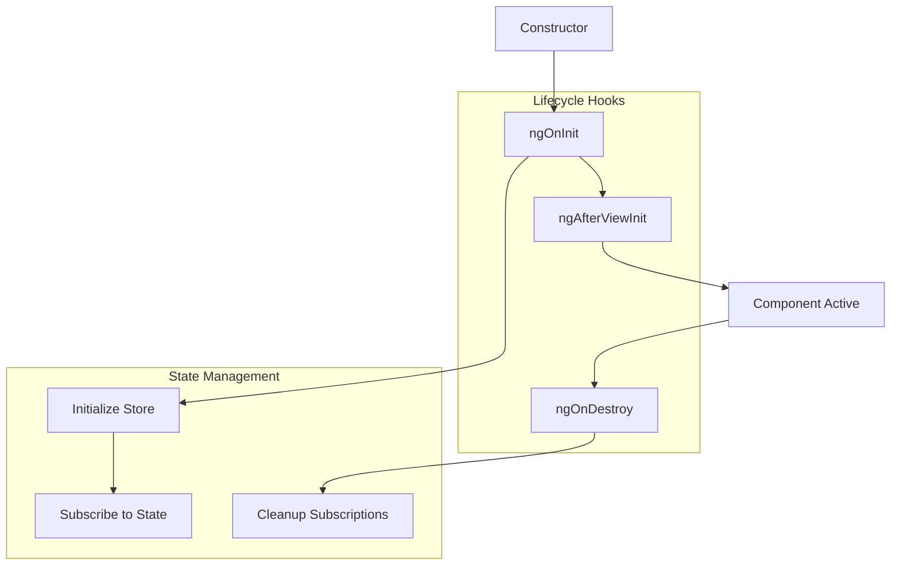

## Error Handling Strategy

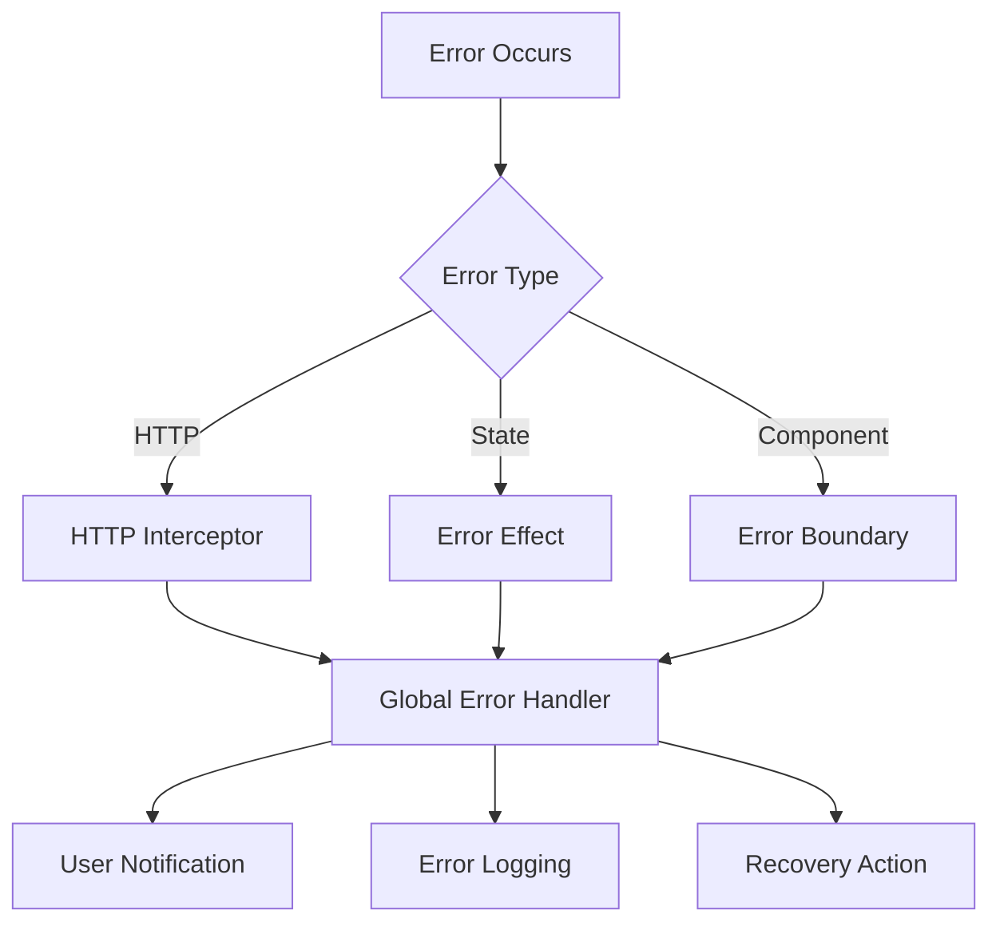

## Deployment Architecture

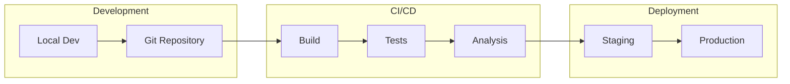

## Security Architecture

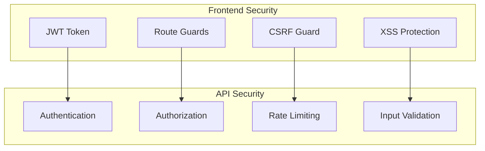